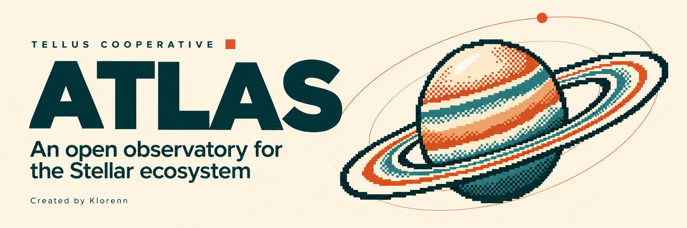
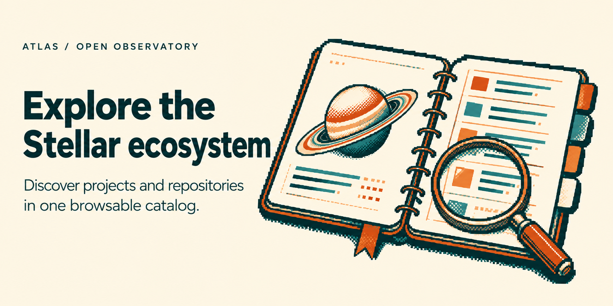
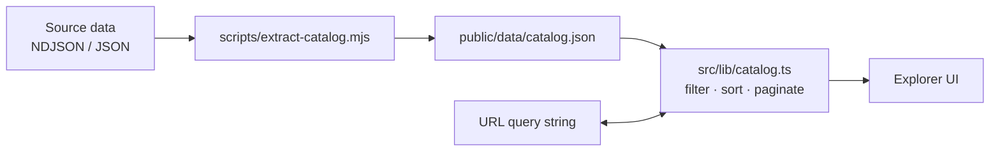
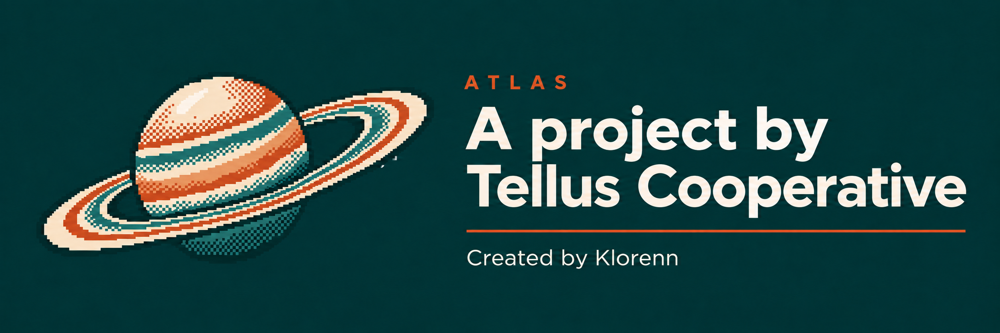

An open observatory for discovering projects and repositories across the Stellar ecosystem.

**[Open ATLAS →](https://atlastelluscoop.vercel.app/)**

[Overview](#overview) · [Explore the ecosystem](#explore-the-ecosystem) · [How it works](#how-it-works) · [Tech stack](#tech-stack) · [Getting started](#getting-started) · [Project structure](#project-structure) · [Development](#development) · [Contributing](#contributing) · [License](#license) · [Credits](#credits)

## Overview

ATLAS turns a public directory of Stellar projects into a catalog you can actually browse. Instead of a flat list of links, every repository arrives with the project it belongs to, the programs that funded or hosted it, the language it is written in, and the person or organization behind it.

It is built for developers looking for prior art before starting something new, for builders trying to find collaborators or adjacent work, and for researchers and anyone mapping what the Stellar ecosystem has actually produced.

The catalog is a static JSON snapshot loaded at runtime. ATLAS does not call the GitHub API from the browser and does not track visitors. What the source does not publish is left empty rather than estimated: a missing star count stays `null`, never `0`.

## Explore the ecosystem



| Capability | Description |
| --- | --- |
| Full-text search | Matches repository name, description, project, organization, builder, language, category and country in a single query. |
| Filters | Funding program, category, primary language and status. |
| Sorting | Last commit, stars, or alphabetical. |
| List and grid views | Two densities for the same result set. |
| Pagination | 24, 48 or 96 entries per page. |
| Shareable state | Search, filters, sorting, view and page are written to the URL query string. |
| Repository detail | A dialog with the project, funding, hackathon builds and related repositories; deep-linkable via `?repo=<slug>`. |

Everything above operates on the snapshot in `web/public/data/catalog.json`. There are no accounts, favorites or background sync.

## How it works

ATLAS is split into two halves that meet at a JSON file.

The build side is a set of Node scripts that read the raw source data, normalize it, and write a compact snapshot. The runtime side is a React single-page app that fetches that snapshot once and does all filtering, sorting and pagination in memory.



`src/lib/catalog.ts` is the only place the raw shape is interpreted: it maps source records to the `Repository` model, derives categories and programs, and resolves the builder attribution. The UI components never touch raw fields.

## Tech stack

| Technology | Role |
| --- | --- |
| React 18 | UI layer |
| TypeScript 5.6 | Types and build-time checking |
| Vite 5 | Dev server and production bundler |
| Tailwind CSS 3.4 | Styling, with the Tellus Cooperative palette in `tailwind.config.js` |
| lucide-react | Icons |
| motion | Animation |
| @paper-design/shaders-react | Dithering backdrop |
| Node.js | Data extraction scripts (ESM) |

## Getting started

### Prerequisites

- Node.js `^18.0.0 || >=20.0.0` (required by Vite 5)
- npm (the repository ships a `package-lock.json`)

### Clone

```bash
git clone https://github.com/Klorenn/ATLAS.git
cd ATLAS/web
```

### Install

```bash
npm install
```

### Run the development server

```bash
npm run dev
```

The app is served at `http://localhost:3002`. No configuration or environment variables are needed: the catalog is read from `public/data/catalog.json`, which is committed.

### Build and preview production

```bash
npm run build
npm run preview
```

`build` runs `tsc --noEmit` before `vite build`, so a type error fails the build. Output goes to `web/dist/`, with `base: './'`, so the bundle can be served from any subpath.

### Regenerate the catalog

```bash
npm run data
```

> `scripts/extract-catalog.mjs` reads the raw dataset from a `data/` directory three levels above `web/`. That dataset lives in the Tellus Cooperative roadmap workspace and is not part of this repository — running `npm run data` outside that workspace will fail. Day-to-day development does not need it: the generated snapshot is already committed.

## Project structure

```text
.
├── assets/readme/        Images used by this README
├── web/                  The ATLAS application
│   ├── public/
│   │   ├── data/         Catalog snapshot (catalog.json, stats.json)
│   │   └── logos/        Ecosystem logos used in the landing page
│   ├── scripts/          Node script that generates the catalog snapshot
│   └── src/
│       ├── components/   Landing sections and the Explorer
│       ├── lib/          catalog.ts (data model, filters, sorting, URL state)
│       └── data.ts       Static copy for the landing page
├── index.html            Standalone page mounting the vanilla explorer
├── explorer.js
├── explorer.css          Vanilla explorer component (no build step)
└── atlas.css
```

The files at the root are an earlier vanilla-JS explorer that runs without a bundler — useful for embedding the catalog in a plain HTML page. The React app under `web/` is the primary experience.

## Development

| Command | What it does |
| --- | --- |
| `npm run dev` | Vite dev server on port 3002 |
| `npm run build` | Type check (`tsc --noEmit`) then production bundle |
| `npm run preview` | Serve the built bundle on port 3002 |
| `npm run data` | Regenerate `public/data/catalog.json` (needs the external dataset) |

There is no linter, formatter or test suite configured in this repository yet. `npm run build` is the only automated check: keep it green before opening a pull request.

## Contributing

Bug reports, ideas and code are welcome. Open an issue using the bug report or feature request template, or send a pull request.

Read [CONTRIBUTING.md](CONTRIBUTING.md) for the full workflow.

## License

Released under the [MIT License](LICENSE).

## Credits


**Project:** Tellus Cooperative
**Creator:** [Klorenn](https://github.com/Klorenn)

ATLAS is an independent community project. It is not affiliated with, or endorsed by, the Stellar Development Foundation.


